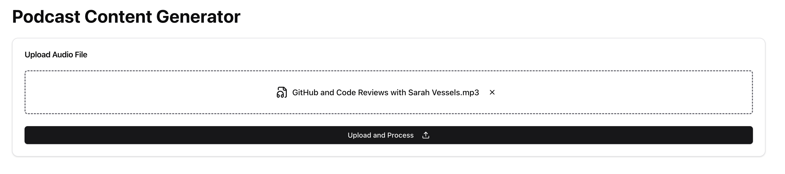
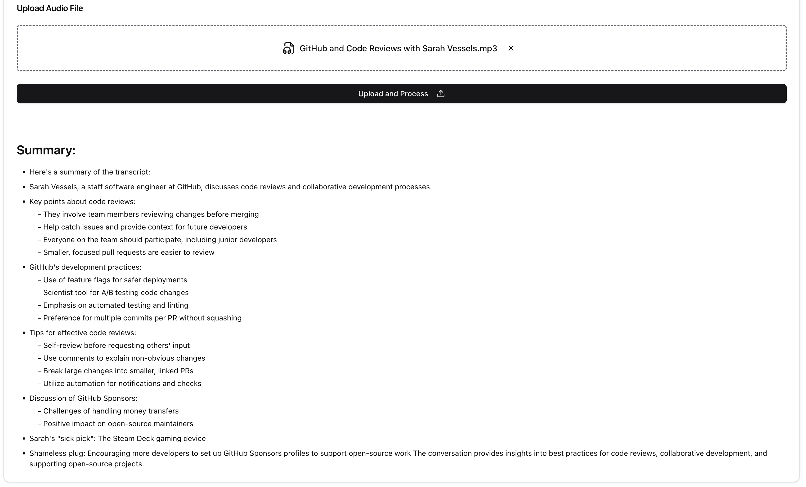

# Podcast Content Generator

A web app that accepts an audio file and generates a summary using AssemblyAI's API.

## Environment Variables

To run this project, you will need to add the following environment variables to your .env file

`ASSEMBLYAI_API_KEY`="your-assemblyai-api-key"

## Features

- Accepting an audio file and generating a summary

## Installation

Install assemblyai-challenge with npm

```bash
git clone git@github.com:jolouie7/assemblyai-challenge.git
cd assemblyai-challenge
npm install
```

## Screenshots

### Homepage:


### File Upload:



### File Summary:



## Roadmap

- [ ] User authentication system
- [ ] Saving and managing multiple summaries
- [ ] Additional customization options for the summary format
- [ ] Support for more file formats
